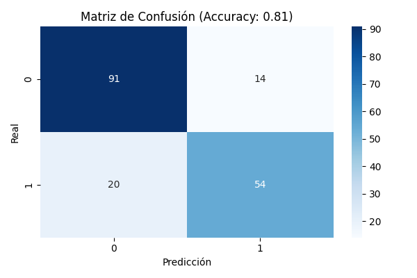
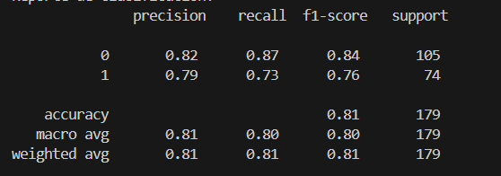

 
**Hecho por Simon Castro**  

##  Punto 1 – Modelo de Aprendizaje Supervisado Clásico  

###  Dataset Seleccionado
- **Nombre:** Titanic - Machine Learning from Disaster (Kaggle)  
- **Tipo de problema:** Clasificación binaria (Sobrevivió / No sobrevivió)  
- **Número de filas:** 891  
- **Número de columnas originales:** 12  

---

### 🧹 Preprocesamiento Realizado
1. **Eliminación de columnas irrelevantes:** `PassengerId`, `Name`, `Ticket`, `Cabin`.  
2. **Manejo de valores nulos:**
   - `Age` → reemplazado por la **media**.
   - `Embarked` → reemplazado por la **moda**.
3. **Codificación de variables categóricas:** OneHotEncoding para `Sex` y `Embarked`.  
4. **Normalización:** `StandardScaler` aplicado a las variables numéricas.  
5. **División del dataset:** 80% entrenamiento, 20% prueba.  

---

###  Modelo Aplicado
Se utilizó un **Random Forest Classifier** con:
- `n_estimators=100`  
- `random_state=42`

---

###  Resultados Obtenidos
- **Accuracy:** `0.8101`
- **Matriz de Confusión:**

- **Reporte de Clasificación:**

---
###  Conclusiones
- El modelo obtuvo un **accuracy del 0.8101%**, mostrando un buen rendimiento para la clasificación de pasajeros.
- Random Forest maneja bien variables mixtas (categóricas y numéricas) sin requerir demasiado preprocesamiento.  
  
