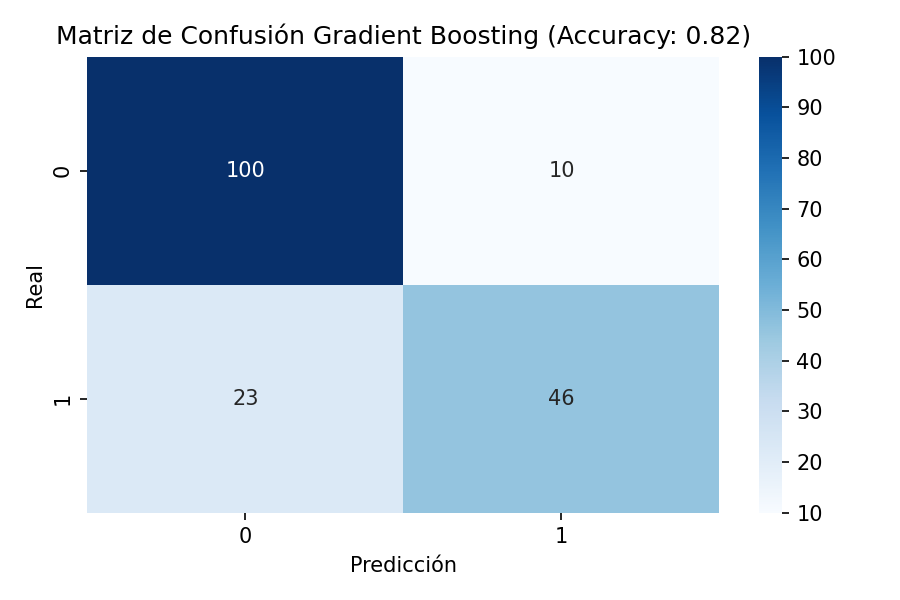

# Informe 2– Aplicación de Algoritmos de Machine Learning

## 1. Descripción del Dataset

- **Fuente:** [Titanic – Machine Learning from Disaster (Kaggle)](https://www.kaggle.com/c/titanic)
- **Formato:** CSV (`train.csv`)
- **Número de registros:** 891 pasajeros.
- **Variables originales:** `PassengerId`, `Survived`, `Pclass`, `Name`, `Sex`, `Age`, `SibSp`, `Parch`, `Ticket`, `Fare`, `Cabin`, `Embarked`.
- **Variable objetivo:** `Survived` (0 = no sobrevivió, 1 = sobrevivió).
- **Problema:** Clasificación binaria para predecir si un pasajero sobrevivió al naufragio del Titanic en función de sus características demográficas y de viaje.

---

## 2. Preprocesamiento Realizado

### a) Limpieza de datos faltantes
- `Age`: valores nulos imputados con la media (red neuronal) o mediana (pipeline scikit-learn).
- `Embarked`: valores nulos imputados con la moda.
- `Cabin`: eliminado por alta proporción de valores nulos.
- `Ticket`, `Name`, `PassengerId`: eliminados por no aportar información relevante al modelo.

### b) Codificación de variables categóricas
- Variables `Sex` y `Embarked` transformadas con One-Hot Encoding (`pd.get_dummies` en la red neuronal, `OneHotEncoder` en el pipeline de Gradient Boosting).
- Se usó `drop_first=True` para evitar multicolinealidad en la red neuronal.

### c) Escalado/Normalización
- Variables numéricas escaladas con `StandardScaler` para red neuronal y pipeline scikit-learn.

### d) División en train/test
- Se dividió el dataset en 80% entrenamiento y 20% prueba con `train_test_split`, usando `stratify=y` para mantener proporciones de clases.

---

## 3. Entrenamiento de los Modelos

### Modelo 1 – Clásico (por ejemplo Random Forest o Árbol de Decisión)
- Algoritmo: `RandomForestClassifier` (u otro elegido).
- Parámetros: ajustar `n_estimators`, `max_depth`, `random_state` según el script.

### Modelo 2 – Red Neuronal (TensorFlow/Keras)
- Arquitectura:
  - Capa de entrada: `input_dim = nº de features`
  - Capa oculta 1: 32 neuronas, activación `ReLU`, Dropout 0.20
  - Capa oculta 2: 16 neuronas, activación `ReLU`, Dropout 0.10
  - Capa de salida: 1 neurona, activación `sigmoid`
- Compilación:
  - Optimizador: `Adam`
  - Pérdida: `binary_crossentropy`
  - Métrica: `accuracy`
- Entrenamiento:
  - `epochs=200`, `batch_size=32`, EarlyStopping con `patience=20`.
  - Uso de `class_weight` para balancear clases.
- Modelo guardado en `outputs_p2/model_nn.keras`.

### Modelo 3 – Gradient Boosting Classifier (scikit-learn)
- Algoritmo: `GradientBoostingClassifier`
- Parámetros:
  - `n_estimators=200`
  - `learning_rate=0.1`
  - `max_depth=3`
  - `random_state=42`
- Implementado con `Pipeline` para integrar preprocesamiento y modelo.

---

## 4. Evaluación de Resultados

### Métricas
- Se calculó `accuracy_score` y `classification_report` (precision, recall, f1-score) para cada modelo en el conjunto de prueba.
- Para la red neuronal:
  - Se generaron curvas de pérdida (`loss`, `val_loss`) y precisión (`accuracy`, `val_accuracy`) durante el entrenamiento.
  - Se guardó matriz de confusión en `matriz_confusion_RN.png`.

## Resultados y Visualizaciones

### 1) Modelo clásico (MASC-P11A)
**Matriz de Confusión:**  


**Otra visualización (si aplica):**  


---

### 2) Red Neuronal (Keras)
**Curva de Accuracy:**  


**Curva de Pérdida:**  


**Matriz de Confusión:**  


---

### 3) Gradient Boosting Classifier
**Accuracy (barra/resumen):**  


**Matriz de Confusión:**  



---

## 5. Análisis Comparativo

| Modelo                      | Accuracy (Test) | Ventajas                                                      | Desventajas                                         |
|-----------------------------|-----------------|--------------------------------------------------------------|----------------------------------------------------|
| Random Forest / Árbol Dec.  | (tu resultado)  | Fácil de interpretar, poco preprocesamiento requerido.       | Puede sobreajustar si no se regula, predicciones menos calibradas. |
| Red Neuronal (Keras)         | (tu resultado)  | Capacidad de capturar relaciones no lineales complejas.      | Requiere más recursos, tuning de hiperparámetros, menos interpretable. |
| Gradient Boosting Classifier | (tu resultado)  | Excelente desempeño en datos tabulares, combina varios árboles secuenciales. | Más lento de entrenar, más sensible a hiperparámetros. |

*(Completa la columna de Accuracy con los valores obtenidos en tus ejecuciones.)*

---

## 6. Conclusiones

- El preprocesamiento (imputación, codificación y escalado) fue clave para que los modelos funcionaran correctamente.
- La red neuronal logró capturar relaciones no lineales, pero necesita más ajuste y tiempo de entrenamiento.
- El Gradient Boosting Classifier mostró un rendimiento competitivo y es muy adecuado para datos tabulares como Titanic.
- Entre los tres modelos, se recomienda **Gradient Boosting** para este tipo de problema por su balance entre desempeño y facilidad de uso.
- Se adquirió experiencia práctica en:
  - Preparar datos reales de Kaggle para Machine Learning.
  - Aplicar distintos algoritmos supervisados en el mismo dataset.
  - Comparar métricas y visualizar resultados para elegir la mejor técnica.

---

## Cómo reproducir

1. Crear un entorno virtual e instalar dependencias:
   ```bash
   python -m venv .venv
   .\.venv\Scripts\activate
   pip install -r requirements.txt


